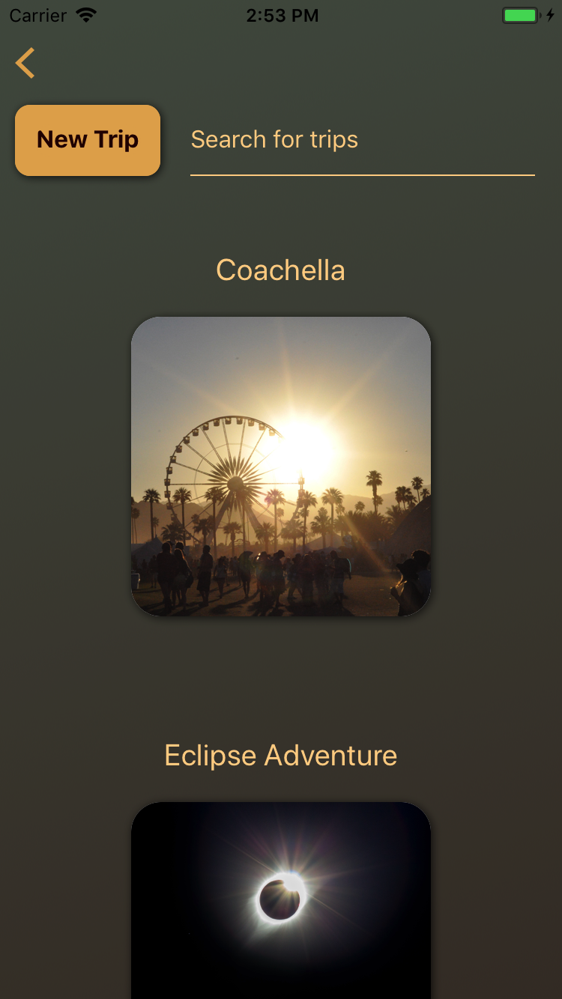
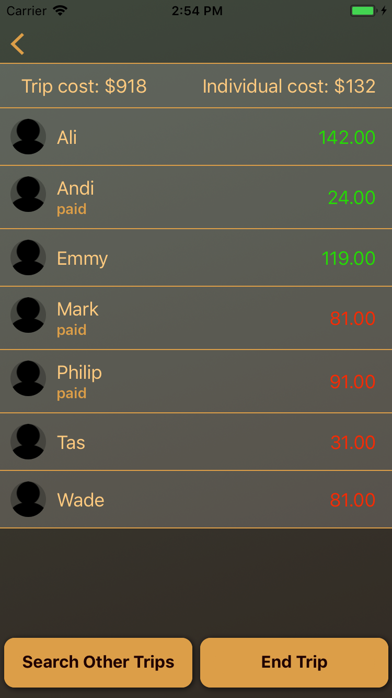

# TripShare Server
Server: https://github.com/tasmandrake/Capstone
It can be difficult to manage group costs while going on trips with a large number of friends and family.  Trip Share allows users to create a shared platform where group members are invited and spending can be managed. During the trip, members can take a picture of a receipt to record how much they spent.  When the trip is over, each person on the trip can see how much they owe or how much they will get back.  Once all users have paid, the trip can be ended and deleted.

There may be times when you have not input all receipts when you return home, so there is an Alexa skill that connects to the server and can add money to anyone on a trip.

Users start off by either logging in with Facebook to create or edit an existing trip, or my continuing with the app to see any active trips.

Users are able to search through all active trips, or create a new trip if they have already logged in.

Once a trip has been selected, a list of all users on that trip will be displayed.  Only the creator of the trip is able to add people to a trip.

To add a receipt, you tap on the person who you are adding money to.  There you can either add in the amount manually, or choose to take a picture of the receipt.

If you take a picture, your image will be processed using Google Cloud Vision OCR, and the total amount spent will be auto filled on the previous screen.

Once the trip has been completed, you are able to see totals for each person on the trip.  Green amounts are money owed to people, and red is amounts that people owe.  These amounts are determined by the individual cost, and if the users spent more or less than that amount.  As the trip creator, you are the only one that is able to mark someone down as having paid.

